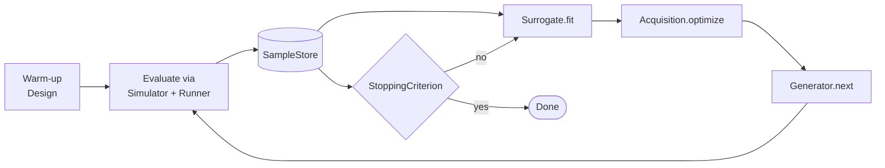

# Bayesian optimization in polarisopt

Quick refresher on the algorithm, then a tour of how polarisopt
composes the pieces.

## What Bayesian optimization does

For an expensive function ``f: X → ℝ`` you can only afford to evaluate
a handful of times, BO maintains a probabilistic model of ``f`` and
picks the next evaluation point to make the **best expected progress**
toward the optimum.

The algorithm:

```
1. Start with an initial design (LHS / Sobol / Morris).
2. Loop:
    a. Fit a surrogate model to (X, Y) so far.
    b. Optimize an acquisition function over the search space — it
       trades off "exploit the predicted minimum" vs "explore where
       the surrogate is uncertain."
    c. Evaluate f at the chosen point(s), append (x, y) to history.
    d. Check stopping criterion.
```

## How polarisopt slices this up



Each step in the BO algorithm is a separate ABC:

| Step | ABC | YAML key | Built-ins |
|---|---|---|---|
| Initial design | `Design` | `phases[].warm_up` | `lhs`, `morris`, `sobol`, `manual` |
| Model | `Surrogate` | `phases[].generator.options.surrogate` | `gp` |
| Sample picker | `AcquisitionFunction` | `phases[].generator.options.acquisition` | `ei`, `qei`, `qehvi`, `qlognei` |
| Batch chooser | `SampleGenerator` | `phases[].generator` | `acquisition`, `random` |
| Stop | `StoppingCriterion` | `phases[].stop` | `max_iter`, `epsilon`, `plateau`, `hypervolume`, `any`, `all` |

You can swap any one of these without touching the others.

## Why BoTorch under the hood

The surrogate (GP) and acquisition implementations are thin wrappers
around [BoTorch](https://botorch.org/). We don't reinvent:

- `SingleTaskGP` / `ModelListGP` with Matern-ARD kernels.
- `LogExpectedImprovement` / `qLogExpectedImprovement` /
  `qLogExpectedHypervolumeImprovement` (the **Log** variants — they're
  numerically more stable than the legacy `ExpectedImprovement` etc.).
- Multi-start gradient-based acquisition optimization via
  `botorch.optim.optimize_acqf`. This is **much** better than grid
  search on a candidate pool, especially in higher dimensions.

The downside: BoTorch is a heavy dependency (pulls in PyTorch). It
lives in the `[bo]` extra so the core polarisopt install stays light.

## Single- vs. multi-objective

For ``m = 1`` (single-objective):

- `GPSurrogate` builds one `SingleTaskGP`.
- `qei` acquires by maximizing `qLogExpectedImprovement` over the GP
  posterior, with a sign-flip objective for minimization.

For ``m > 1`` (multi-objective):

- `GPSurrogate` wraps `m` `SingleTaskGP`s in a `ModelListGP`.
- `qehvi` acquires by maximizing `qLogExpectedHypervolumeImprovement`
  vs. a reference point that's "worse than every observation."

See [Concept: Multi-objective](multi-objective.md) for the details.

## Batch vs. single-point

`qei` / `qehvi` are **batch acquisitions**: they jointly optimize ``q``
new points at once, accounting for the predicted correlations between
proposals. Setting `batch_size: q` in the YAML is the only thing you
need to do. For `q = 1` they reduce to single-point semantics.

The analytic `ei` is single-point only — use `qei` (with q=1 if you
want) for the standard recommendation.

## Noise-aware BO (`qlognei`)

`qei` treats each observed value as ground truth: `best_f = min(Y)`.
That works when the objective is deterministic (Branin, high-fidelity
simulators). It breaks when the objective is a noisy realisation of an
unknown mean — a stochastic simulator, POLARIS at low
`population_scale_factor`, or any run whose metric has measurable
seed-to-seed variance. Then a "favorable seed" outlier gets picked as
the incumbent, BO chases that noisy minimum, and the loop never
converges to the true optimum.

`qlognei` (BoTorch's `qLogNoisyExpectedImprovement`) fixes this by
computing EI relative to the **posterior over the previously-evaluated
points** — treating each observed value as one noisy draw from an
unknown mean rather than the mean itself.

```yaml
generator:
  type: acquisition
  options:
    surrogate: { type: gp, options: {} }
    acquisition:
      type: qlognei
      options:
        mc_samples: 128
        prune_baseline: true       # BoTorch default; drops unlikely-incumbent baseline points
```

Use `qlognei` when:

- Repeat evaluations at the same input give visibly different metric values.
- The best-so-far chase never converges — each iteration picks a new
  "winner" that turns out to be a lucky seed on re-evaluation.
- You've measured a non-negligible noise std (e.g. via Sobol
  replication or a dedicated noise-estimation phase).

For deterministic simulators, `qei` remains the right choice — no
advantage from noise modelling if there's no noise.

**Related lever (not yet a plugin):** if you have a measured noise
level, an observation-noise-aware surrogate (`FixedNoiseGP` instead of
`SingleTaskGP`) lets the surrogate use your measurement instead of
inferring it from residuals. Flagged for a future release.

## Minimize vs. maximize

polarisopt defaults to **minimization** (`minimize: true` in
sequential phases). Internally we negate the GP outputs when calling
BoTorch's maximize-based acquisitions, so single- and multi-objective
both behave correctly.

For maximization, set `minimize: false`. This is the right choice if
your metric is a quantity-to-maximize (revenue, throughput, accuracy).

## See also

- [Multi-objective](multi-objective.md)
- [Surrogate API](../reference/api/surrogates/base.md)
- [Acquisition API](../reference/api/acquisition/base.md)
- [Tutorial 01 · Branin demo](../tutorials/01-branin-demo.md)
