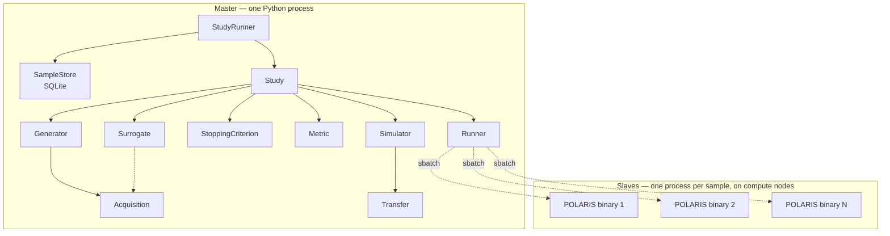

# Master/slave architecture

polarisopt cleanly separates **orchestration** (the master) from
**simulation execution** (slaves). The boundary is the `Runner` ABC.

## What lives where

## Why split it this way

**Mathematical / orchestration layer in the master.** GP fitting, BO
acquisitions, decision logic — these run on the head node (or a small
allocation), use a fraction of a CPU, and need persistent state.
Putting them in long-lived workers is overkill.

**Simulation execution on slaves.** POLARIS runs are heavy
(30+ minutes, 60+ GB of memory). They want full compute nodes and
benefit from running in parallel via Slurm's scheduler.

**The Runner ABC is the only place these talk.** The master gives the
runner a `JobSpec`; the runner answers with `JobStatus` updates. Neither
side imports the other's internals.

## Consequences

### The master never imports POLARIS

The `Simulator` ABC turns a Sample into a `JobSpec`. `PolarisSimulator`
stages files and constructs the shell command; the actual binary runs
on a slave. The master process doesn't even need POLARIS installed.

### The master can die without losing work

Every state transition is persisted to the SampleStore (SQLite, WAL
mode). Sequential phases checkpoint RNG state to `phase_state`. After
`Ctrl-C`, `polarisopt resume study.yaml` reads the store, refits the
surrogate, restores the RNG, and continues. See
[Concept: Restart correctness](restart-correctness.md).

### Slaves are stateless

Each Slurm job is a fresh sbatch — no persistent worker pool to manage.
Per-sample startup overhead is ~10 seconds. For sub-minute
simulations this is a real cost; for DFW-class iterations (~hours each)
it's < 1% and bought us simplicity instead.

### Cancellation is two-phase

`polarisopt cancel <study> <sample_id>` does two things:

1. `Runner.cancel(job)` — `scancel <jobid>` (slave side).
2. `store.update(sample, status=CANCELLED)` (master side).

If you `scancel` directly outside polarisopt, the master will eventually
see the job vanish from squeue/sacct and force-FAIL the sample via
orphan detection.

## What this is *not*

- **Not a long-running daemon.** There's no `polarisopt-server`. Each
  `polarisopt run` is one master process. Studies are persisted to
  files (YAML + SampleStore) so the master is disposable.
- **Not a worker pool.** No `worker_loop.py`, no `worker_id` regex
  pinning, no Postgres queue. If you previously used EQ-SQL, those
  concepts don't apply.
- **Not single-machine.** The master is single-machine; the simulations
  fan out across the Slurm cluster.

## See also

- [Architecture overview](../architecture.md) (module map)
- [Plugin registries](plugin-registries.md)
- [Runner API](../reference/api/runners/base.md)
