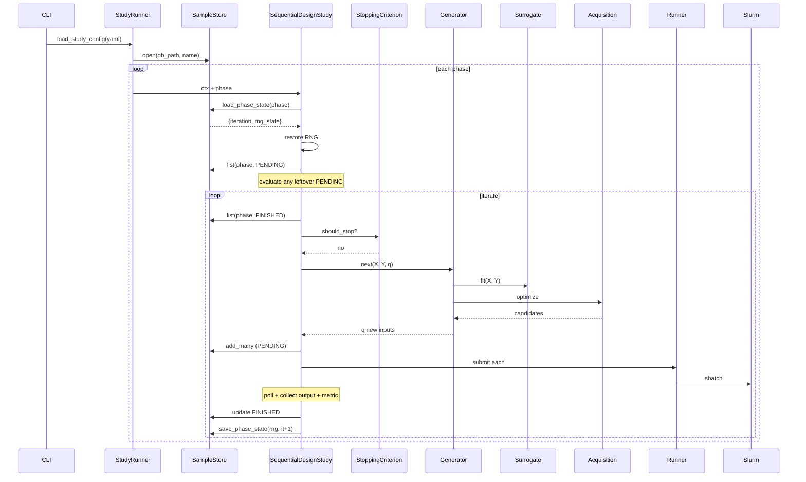

# Restart correctness

What "restart-safe" means in polarisopt, and why.

## The guarantees

After `polarisopt resume study.yaml`, a study behaves **statistically
identically** to one that wasn't interrupted — same RNG draws, same
acquisition recommendations, same final state — provided:

1. The study YAML wasn't edited in incompatible ways (see below).
2. The SampleStore wasn't tampered with externally.
3. The Slurm cluster still recognizes any jobs the master submitted.

## Why this is non-trivial

A Bayesian-optimization study has hidden state at every layer:

| Layer | Hidden state | Survival strategy |
|---|---|---|
| Sample evaluations | `(x, y)` history | SQLite `samples` table |
| Iteration counter | Current loop index | `phase_state.iteration` |
| RNG | Acquisition restarts, MC samples, etc. | `phase_state.rng_state` (pickle of `np.random.BitGenerator.state`) |
| Surrogate | Hyperparameters | **Refit from store on demand** |
| In-flight jobs | Slurm jobids | `samples.runner_task_id` |

Each piece is persisted somewhere durable.

## Why we don't pickle the surrogate

GP hyperparameters are a few dozen floats; refitting takes seconds even
with thousands of data points. Pickling torch state across versions is
brittle. So we **refit from the SampleStore on resume** and keep
serialization small.

## Why we save the RNG state

BO is deterministic *given* the same RNG and same data. If we resumed
with a fresh RNG, the BoTorch acquisition's multi-start optimization
and qMC sampling would produce different proposals — same data, same
surrogate, different next point.

Saving `rng.bit_generator.state` (a dict) and restoring it preserves
exact reproducibility.

## YAML compatibility on resume

You can edit some things between runs:

| Editable on resume | Why |
|---|---|
| `phases[].stop.criteria` knobs (`max_iter`, `epsilon`, ...) | Stop logic re-evaluates against the current store every iteration. |
| `phases[].generator.options.acquisition.options.mc_samples` | Affects the next iteration's acquisition; existing samples are unchanged. |
| `runner.options` (resources, poll_interval, orphan_threshold) | Slurm submission concerns, no effect on already-stored samples. |

You should *not* edit:

| Don't edit | Why |
|---|---|
| `parameters` | Samples in the store have a specific ``ndim``. Adding/removing dims invalidates the surrogate. |
| `metric.type` or its `options` | The store's `metric_json` blobs reflect the old metric's outputs. |
| `simulator` (especially `model_source`) | The folder on disk for each old sample reflects the previous model. |
| `phases[].name` | The store rows are keyed to the original phase name. |

If you need any of those changes, **start a new study with a new
workspace**. SampleStore is per-workspace; a fresh workspace gives a
fresh start.

## Sequence of events on resume

The only step that's "resume-aware" is the very first
`load_phase_state`. After that, the regular loop runs to completion.

## When restart isn't perfect

There are edge cases where strict statistical identity is impossible:

- **Slurm lost a job between runs.** The orphan-detection threshold
  marks it FAILED — that's deterministic, but the failed sample now
  influences the surrogate differently than if it had finished. Use
  ``polarisopt resume`` repeatedly only if you can tolerate that one
  failed sample affecting subsequent proposals.
- **Code changes between runs.** If you `git pull` polarisopt or any
  plugin module between crash and resume, surrogate/acquisition
  behavior may differ. For reproducibility studies, freeze versions.
- **Filesystem missing for a finished sample.** If
  `simulator.collect_output` fails because the workspace was deleted,
  the sample transitions to FAILED.

For most real-world calibrations these are acceptable.

## See also

- [SampleStore API](../reference/api/samples/store.md)
- [Tutorial 04 · Restart](../tutorials/04-restart.md)
