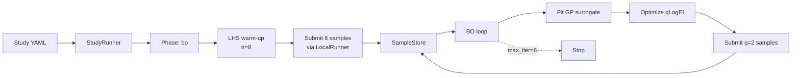

# 01 · Branin demo (5 minutes, no POLARIS required)

The fastest path from `pip install` to a working Bayesian-optimization
loop. Uses the [Branin function](https://www.sfu.ca/~ssurjano/branin.html) —
a 2D test problem with three known global minima — instead of POLARIS,
so you can verify your install before touching real models.

## Prerequisites

```bash
pip install 'polarisopt[bo]'
```

`[bo]` pulls in BoTorch, GPyTorch, and PyTorch.

## 1. Write the study YAML

Save as `branin.yaml`:

```yaml
name: branin-demo
workspace: /tmp/branin-demo
seed: 42

simulator:
  type: mock
  options:
    function: branin

runner:
  type: local
  options: {}

parameters:
  inline:
    - { name: x1, file: dummy.json, min: -5.0, max: 10.0 }
    - { name: x2, file: dummy.json, min:  0.0, max: 15.0 }

metric:
  type: identity
  options:
    keys: value

phases:
  - name: bo
    type: sequential
    warm_up:
      type: lhs
      options:
        n: 8
    generator:
      type: acquisition
      options:
        surrogate: { type: gp,  options: {} }
        acquisition: { type: qei, options: { mc_samples: 128 } }
    batch_size: 2
    stop:
      type: max_iter
      options:
        n: 6
```

## 2. Run

```bash
polarisopt run branin.yaml
```

Expected output:

```
... (a few seconds of GP fitting + acquisition optimization per iteration) ...
completed: 20/20 samples (failed: 0)
```

Budget: 8 warm-up + 6 iterations × q=2 = 20 evaluations total.

## 3. Inspect

```bash
polarisopt status branin.yaml
```

```
bo: {'finished': 20}
```

Open the SampleStore from Python:

```python
from polarisopt.samples.store import SampleStore
from polarisopt.utils.paths import workspace_layout

layout = workspace_layout("/tmp/branin-demo")
store = SampleStore.open(layout["db"], "branin-demo")
df = store.to_dataframe()
df.sort_values("iteration").head()
```

The Branin global minimum is ≈ 0.397887. With 20 evaluations you should
typically reach < 1.0:

```python
import numpy as np
best = min(np.asarray(m)[0] for m in df["metric"])
print(f"best Branin value: {best:.4f}")
```

## 4. What just happened



1. The CLI loaded `branin.yaml` and instantiated the master.
2. `StudyRunner` opened (or created) `/tmp/branin-demo/polarisopt.db`.
3. The LHS warm-up generated 8 random samples, evaluated each in a slave
   subprocess via `MockSimulator + LocalRunner`.
4. For each of 6 iterations, the master:
    - Refit a Gaussian-Process surrogate to the SampleStore history.
    - Optimized **qLogEI** to pick the next 2 inputs.
    - Submitted them via the runner, waited, collected outputs.
    - Checkpointed RNG + iteration to `phase_state`.

## 5. Next steps

- Kill the run mid-flight (Ctrl-C) and try
  [Tutorial 04 · Restart](04-restart.md).
- Switch the design to Morris and explore
  [Tutorial 02 · Morris screening](02-morris-screening.md).
- Try a real POLARIS model via
  [Tutorial 05 · First POLARIS run](05-first-polaris.md).
