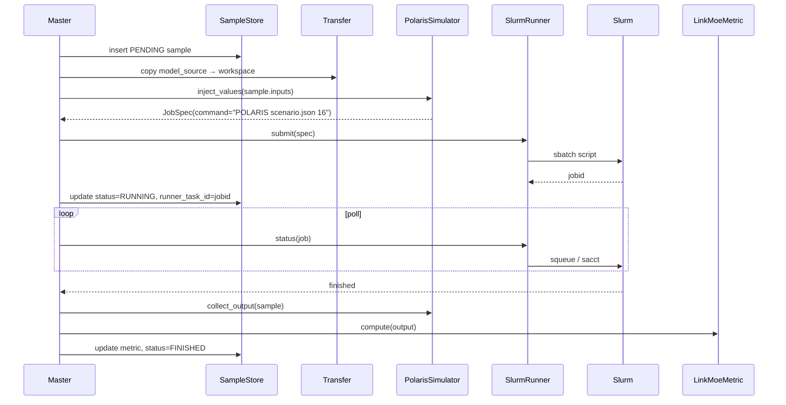

# 05 · Your first POLARIS run

Wire polarisopt to a real POLARIS model and run a small calibration on
a Slurm cluster.

## Prerequisites

- A POLARIS model directory with a `scenario_abm.json` and one or more
  parameter-bearing JSONs (e.g. `DestinationChoice.json`).
- A POLARIS binary or Apptainer image you can execute.
- Access to a Slurm cluster (Crossover, Bebop, Improv, your own).
- ``pip install 'polarisopt[bo]'`` on a node with `sbatch`/`squeue` in
  ``PATH``.

## 1. Declare the parameters

Write `params.yaml` listing what you want to calibrate. Each record
names the POLARIS JSON file that owns the variable:

```yaml
# params.yaml
- { name: trip_threshold,   file: DestinationChoice.json, min: 0.05, max: 0.5  }
- { name: gravity_alpha,    file: DestinationChoice.json, min: 0.5,  max: 2.0  }
- { name: pickup_walk_max,  file: ActivityChoice.json,    min: 100,  max: 1000, type: float }
```

polarisopt will look these names up in the JSONs of each staged
workspace, replace the values, and save.

## 2. Write the study YAML

```yaml
# dfw-calibration.yaml
name: dfw-calib-v1
workspace: /lcrc/project/POLARIS/{{ env.USER }}/experiments/dfw-{{ now('%Y%m%d-%H%M%S') }}
seed: 7

simulator:
  type: polaris
  options:
    binary: /lcrc/project/POLARIS/.../polaris_exe/Integrated_Model.sif
    model_source: /lcrc/project/POLARIS/.../DFW_2050_20251028
    scenario_file: scenario_abm.json
    output_db_filename: DFW-Result.h5
    num_threads: "16"

runner:
  type: slurm
  options:
    default_resources:
      partition: bdwall
      account: POLARIS
      time: "04:00:00"
      nodes: 1
      cpus_per_task: 16
      mem: 64G
    orphan_threshold: 5     # tolerate occasional squeue/sacct hiccups
    poll_interval: 30

parameters:
  source: ./params.yaml

metric:
  type: link_moe
  options:
    target: /lcrc/project/POLARIS/.../baseline/DFW-Result.h5
    aggregation: rmse

phases:
  - name: warmup-lhs
    type: static
    design: { type: lhs, options: { n: 8 } }

  - name: bo
    type: sequential
    generator:
      type: acquisition
      options:
        surrogate:  { type: gp, options: {} }
        acquisition: { type: qei, options: { mc_samples: 256 } }
    batch_size: 4
    stop:
      type: any
      criteria:
        - { type: max_iter, options: { n: 12 } }
        - { type: epsilon,  options: { epsilon: 0.01 } }
```

Notes:

- The `workspace` field uses Jinja2 — `env.USER` and `now()` are
  available globals (see [YAML reference](../yaml-reference.md)).
- Two phases: an LHS warm-up writes 8 initial points; the sequential
  phase then runs qLogEI on top.
- The metric reads HDF5 from each evaluation and compares to a baseline.

## 3. Run

```bash
polarisopt --log-level INFO run dfw-calibration.yaml
```

What happens, per sample:



## 4. Monitor

In another shell:

```bash
polarisopt status dfw-calibration.yaml
polarisopt logs   dfw-calibration.yaml 5            # one sample's logs
polarisopt logs   dfw-calibration.yaml 5 --follow   # stream live
```

## 5. If something goes wrong

```bash
polarisopt logs dfw-calibration.yaml <bad_sample_id>
```

Look at:

- `polaris.stderr.log` — POLARIS-side errors (segfault, missing file).
- `polaris.stdout.log` — POLARIS-side progress.
- `slurm-NNNNN.out` — sbatch wrapper output (resource limit hits, etc.).

To cancel one in-flight sample:

```bash
polarisopt cancel dfw-calibration.yaml <sample_id>
```

To cancel everything pending or running:

```bash
polarisopt abort dfw-calibration.yaml
```

The master loop respects these — the orphan-detection threshold means
it won't poll forever for a vanished Slurm job.

## 6. Resume after interruption

```bash
polarisopt resume dfw-calibration.yaml
```

Same YAML, same workspace, same store. See
[Tutorial 04 · Restart](04-restart.md) for the mechanics.

## See also

- [PolarisSimulator API](../reference/api/simulator/polaris.md)
- [How-to: Run on Slurm](../how-to/run-on-slurm.md)
- [How-to: Use Globus](../how-to/use-globus.md) (for VMS-backed paths)
