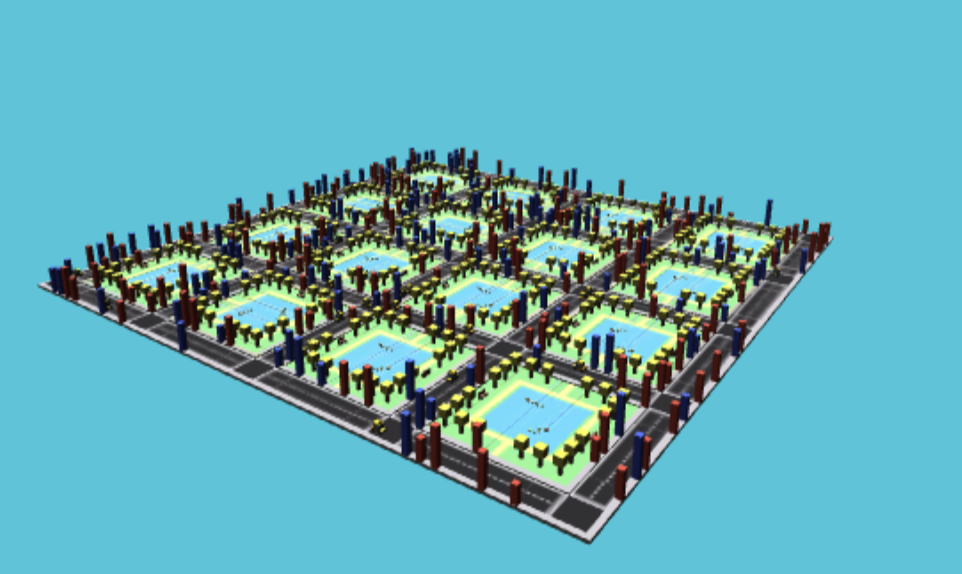
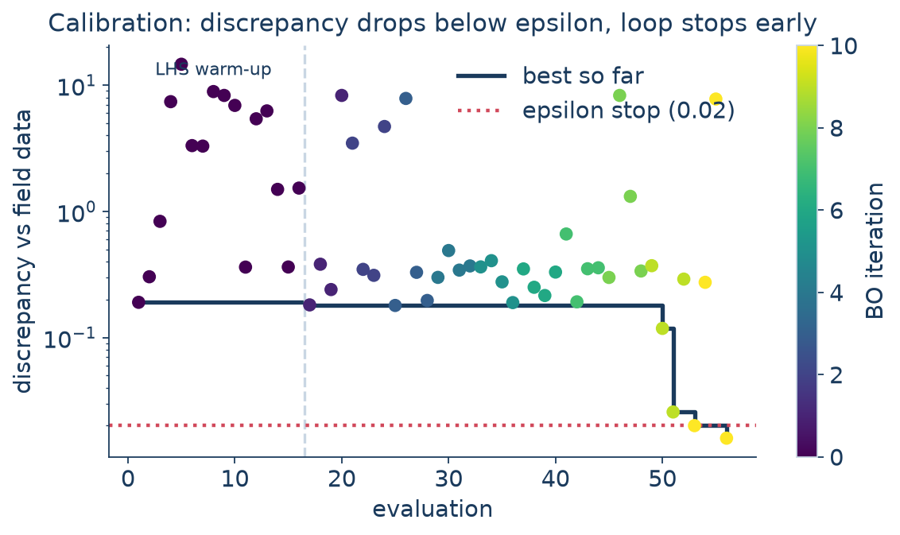

## The setting {.smaller}

A calibrated POLARIS model is the product of **many full simulation runs**.

- A single full-region iteration takes **hours** of wall-clock time and **60+ GB** of memory.
- Dozens of behavioral parameters are scattered across POLARIS JSON config files.
- Whether a parameter set matches the observed link counts can be answered only by *running the model*.

This is the **expensive black-box** regime:

> evaluations are expensive, gradients are unavailable, and the simulator is stochastic.

**PolarisOpt** is the library that chooses which evaluations to run, for **calibration** (matching observed data) and **exploration** (screening, optimization, and sensitivity analysis).

## What PolarisOpt is {.smaller}

Modular **design-of-experiments** and **Bayesian optimization** for POLARIS.

::: {.columns}
::: {.column width="50%"}
### Static design of experiments
*One-shot* sample generation for screening and sensitivity.

- Latin Hypercube
- Morris (elementary effects)
- Sobol
- Manual
:::
::: {.column width="50%"}
### Sequential design of experiments
*Adaptive* surrogate-driven Bayesian optimization.

- GP / Multi-task GP surrogates
- qLogEI / qLogEHVI acquisition
- Single- **and** multi-objective
- Pluggable stopping criteria
:::
:::

A study is configured in **YAML** and run from the **CLI** or **Python**. Every evaluation is persisted to **SQLite**, so a study survives a crash and can **resume**.

## The sequential design loop

```{mermaid}
%%| fig-width: 9
graph LR
    D["Design / Acquisition<br/>(pick next samples)"] -->|submit| R["Runner<br/>(local / Slurm)"]
    R -->|simulate| S["Simulator<br/>(POLARIS / taxi)"]
    S -->|outputs| M["Metric<br/>(link_moe / output_match)"]
    M -->|objective| ST["SampleStore<br/>(SQLite)"]
    ST -->|fit| SU["Surrogate<br/>(GP)"]
    SU --> D
    ST -.->|stop?| X(("done"))

    classDef box fill:#ffffff,stroke:#1a6fb5,stroke-width:1px,color:#1a3a5c;
    class D,R,S,M,ST,SU,X box;
```

Each box is a **swappable plugin**. The loop is the same whether the black box is a 6-hour regional POLARIS run or a 0.3-second taxi simulation.

## A study is one YAML file {.smaller}

```yaml
name: region-calibration
workspace: /lcrc/.../experiments/region-001   # SampleStore + per-sample dirs live here
seed: 42

simulator:                                    # the black box
  type: polaris
  options: { binary: Integrated_Model.sif, model_source: Region_2050, num_threads: "16" }

runner:                                        # where it runs
  type: slurm
  options: { default_resources: { partition: TPS, time: "04:00:00", mem: 64G } }

parameters:                                    # what to vary (mapped into POLARIS JSONs)
  source: ./params.yaml

metric:                                        # what "good" means
  type: link_moe
  options: { target: baseline/Result.h5, aggregation: rmse }

phases:                                        # the plan
  - { name: screen, type: static, design: { type: lhs, options: { n: 16 } } }
  - name: calibrate
    type: sequential
    warm_up: { type: lhs, options: { n: 8 } }
    generator: { type: acquisition, options: { surrogate: {type: gp}, acquisition: {type: qei} } }
    stop: { type: any, criteria: [ {type: max_iter, options: {n: 12}}, {type: epsilon, options: {epsilon: 0.01}} ] }
```

## `params.yaml`: the knobs {.smaller}

That `source:` field points at this file, a **flat list of records**, one per parameter:

```yaml
# Each record: the knob, which POLARIS JSON holds it, and the search bounds.
- { name: auto_asc,          file: ModeChoice.json,        min: -2.0,  max: 2.0,   type: float }
- { name: transit_ivtt,      file: ModeChoice.json,        min: -0.05, max: -0.01, type: float }
- { name: dest_dist_coeff,   file: DestinationChoice.json, min: -0.30, max: -0.05, type: float }
- { name: activity_duration, file: ActivityChoice.json,    min: 0.5,   max: 4.0,   type: float }
- { name: max_destinations,  file: DestinationChoice.json, min: 5,     max: 30,    type: int   }
```

polarisopt injects each sampled value into the named JSON before every run (`type` is `float` by default, or `int`). Adding a parameter is **one line here**, with no code change. The same list can go directly under `inline:` in the study YAML, which is what the taxi demo does.

## Run it

```bash
polarisopt validate study.yaml     # schema + plugin-option check (<1s)
polarisopt plan     study.yaml     # stage sample 0, render the sbatch script, submit nothing
polarisopt run      study.yaml     # submit + poll the whole study
polarisopt status   study.yaml -v  # per-sample table: jobid, runtime, last log line
polarisopt resume   study.yaml     # pick up an interrupted run
polarisopt best     study.yaml     # winning sample's inputs + metric (--json to pipe)
polarisopt retry-failed study.yaml --run
```

`validate` and `plan` catch mistakes such as a wrong plugin name or an option the
constructor does not accept in about **a second**, rather than after a 30-second
stage in a real run.

## Master / slave architecture {.smaller}

::: {.columns}
::: {.column width="55%"}
```{mermaid}
%%| fig-width: 6
graph TB
    subgraph M["Master: one Python process"]
        SS[SampleStore SQLite]
        SR[StudyRunner]
        GP[Surrogate / Acquisition]
        RN[Runner ABC]
    end
    subgraph SL["Slaves: one process per sample"]
        P1[POLARIS binary]
        P2[POLARIS binary]
    end
    SR --> SS
    SR --> GP
    SR --> RN
    RN -. sbatch .-> P1
    RN -. sbatch .-> P2

    classDef box fill:#ffffff,stroke:#1a6fb5,stroke-width:1px,color:#1a3a5c;
    class SS,SR,GP,RN,P1,P2 box;
    style M fill:#eef3f8,stroke:#c9d6e3,stroke-width:1px,color:#1a3a5c;
    style SL fill:#eef3f8,stroke:#c9d6e3,stroke-width:1px,color:#1a3a5c;
```
:::
::: {.column width="45%"}
**The master never imports POLARIS.**

- The math layer (GP fit, acquisition) needs only a fraction of a CPU, so the master can run on the head node or as its own lightweight Slurm/PBS job on a compute node.
- Heavy simulations fan out across Slurm or PBS.
- The `Runner` ABC is the **only** boundary.
- Every state transition is written to the SampleStore, so a study can be killed and resumed.
- There is no daemon, worker pool, or Postgres queue.
:::
:::

## Everything is a plugin {.smaller}

Each swappable piece is an ABC + a registry. Add one with a class and a
`@register("name")` decorator; reference it from YAML. External packages
ship plugins through **entry points**, with no core changes.

| Family | Built-in implementations |
|---|---|
| **Design** | `lhs` · `morris` · `sobol` · `manual` |
| **Surrogate** | `gp` · `mtgp` (multi-task) |
| **Acquisition** | `ei` · `qei` (qLogEI) · `qehvi` (qLogEHVI, multi-obj) |
| **Stop** | `max_iter` · `epsilon` · `plateau` · `hypervolume` · `any` · `all` |
| **Metric** | `identity` · `link_moe` · `choice_share` · `constant` |
| **Simulator** | `mock` · `polaris` · `polaris_convergence` |
| **Runner** | `local` · `slurm` |
| **Transfer** | `local` · `anl` · `globus` |

## Same study, laptop → cluster {.smaller}

Only the **runner** changes. The simulator, parameters, metric, and phases are untouched.

::: {.columns}
::: {.column width="30%"}
**Laptop**
```yaml
runner:
  type: local
  options: {}
```
:::
::: {.column width="35%"}
**Crossover (Slurm)**
```yaml
runner:
  type: slurm
  options:
    default_resources:
      partition: TPS
      account: tps
      time: "04:00:00"
      mem: 64G
```
:::
::: {.column width="35%"}
**Improv / Bebop (PBS)**
```yaml
runner:
  type: pbs
  options:
    default_resources:
      queue: compute
      account: POLARIS
      walltime: "04:00:00"
```
:::
:::

Develop and debug a study on a laptop, then run the *same file* on the cluster
for the real run.

# Demonstrating it: the Taxi simulator {background-color="#1a3a5c"}

## Why a toy simulator? {.smaller}

POLARIS is the real target but is too slow to demonstrate live. The demo needs a
stand-in that is **fast** but still exercises the same structure.

::: {.columns}
::: {.column width="55%"}
A pure-Python, **seedable** port of Amazon's
[emukit-playground](https://github.com/amzn/emukit-playground) taxi simulator:

- City grid, fleet of taxis, journey requests, surge pricing.
- Tunable inputs: `taxi_count`, `base_fare`, `cost_per_tile`, `max_multiplier`, …
- Outputs: `profit`, `journeys_completed`, `pick_up_time`, `missed`.
- **Stochastic**, like POLARIS; averages over seeded repeats.
- One run ≈ **0.3 s** instead of 6 hours.
:::
::: {.column width="45%"}

:::
:::

It uses the same `Simulator`, `Metric`, and `Runner` contracts as a real POLARIS
study, so the demonstrated workflow matches the real one, only faster.

## Five demo workflows {.smaller}

| # | Workflow | Capability shown | Where |
|---|---|---|---|
| 1 | Explore the simulator | the black box itself | notebook |
| 2 | **LHS screening** | static design of experiments + SampleStore | laptop |
| 2b | **Morris screening** | sensitivity / which knobs matter | laptop |
| 3 | **Bayesian optimization** | GP + qEI, maximize profit | laptop → Crossover |
| 4 | **Calibration** | inverse problem, custom metric | laptop → today's demo |

Verified end-to-end (seed 42): default settings earn about **6,000** profit,
a 64-sample LHS screen finds **15,645**, and the 32-evaluation BO study finds
**16,834** and stops on a plateau.

## Bayesian optimization, concretely {.smaller}

The GP **surrogate** interpolates the few expensive runs; **Expected
Improvement** turns predicted mean and uncertainty into *where to sample next*:
it explores where the model is uncertain and exploits where the predicted profit is high.


## Write your own simulator {.smaller}

A `Simulator` turns a sample into a job and reads its output back. Register it
through an entry point; after `pip install`, `type: taxi` works in any YAML.

::: {.columns}
::: {.column width="58%"}
```python
@simulator_registry.register("taxi")
class TaxiSimulator(Simulator):
    def prepare(self, sample, space, workspace):
        params = space.values_dict(sample.inputs)
        (workspace / "inputs.json").write_text(
            json.dumps({"params": params, "seed": ...}))
        return JobSpec(
            command="python -m taxidemo.runner "
                    "inputs.json outputs.json",
            cwd=workspace)

    def collect_output(self, sample):
        return json.loads(
            (sample.folder / "outputs.json").read_text())
```
:::
::: {.column width="42%"}
```toml
# pyproject.toml
[project.entry-points."polarisopt.simulators"]
taxi = "taxidemo.plugin"
```

The master stays independent of POLARIS: it only sees a `JobSpec` going in and a
dict coming out. The same contract wraps the POLARIS binary.
:::
:::

## Write your own metric {.smaller}

A `Metric` turns simulator outputs into the number the optimizer minimizes or
maximizes. Here is taxidemo's calibration metric, the toy analog of POLARIS's `link_moe`.

```python
@metric_registry.register("output_match")
class OutputMatchMetric(Metric):
    """Mean squared relative error between outputs and observed targets. 0 = perfect."""
    def compute(self, output) -> np.ndarray:
        errors = [((output[k] - t) / self._scales[k]) ** 2
                  for k, t in self._targets.items()]
        return np.asarray([float(np.mean(errors))])
```

```yaml
metric:
  type: output_match
  options:
    targets_file: ~/taxidemo-runs/calibration-targets.json
```

Replacing `output_match` with `link_moe` makes the same study calibrate real POLARIS link volumes.

## Calibration: the inverse problem {.smaller}

Optimization asks which inputs maximize profit. Calibration asks a different
question: which inputs reproduce the **observed data**?

We validate the pipeline with a **parameter-recovery test**:

1. Pick *true* parameters; simulate synthetic "field data" (seeds the calibration never sees).
2. **Hide** the truth and calibrate against the data alone, minimizing `output_match`.
3. Compare what we recover to the truth.

```yaml
phases:
  - name: calibrate
    type: sequential
    minimize: true
    warm_up:   { type: lhs, options: { n: 16 } }
    generator: { type: acquisition, options: { surrogate: {type: gp}, acquisition: {type: qei} } }
    stop: { type: any, criteria: [ {type: max_iter, options: {n: 12}},
                                   {type: epsilon, options: {epsilon: 0.02}} ] }
```

# Live demo {background-color="#1a3a5c"}


::: {.notes}
DEMO (~8 min). Kernel = the taxidemo venv (python3).
1. Generate synthetic field data from hidden true params (taxi_count=40, base_fare=7.5, ...).
2. Show the study YAML.
3. run_study(...): workspace is pre-warmed, so it resumes the finished store in <1s (no wait); narrate the master/slave loop over the convergence plot, not during the run.
4. Convergence plot: discrepancy drops below epsilon, plateau/epsilon stop fires.
5. Two report cards: data-space match (held-out seeds) vs parameter-space recovery.
6. Land the identifiability point, then segue to next slide.
:::

## Calibration convergence {.smaller}



## What the demo shows {.smaller}

::: {.columns}
::: {.column width="50%"}
**The result**

- 56 evaluations, about **105 s** total.
- The `epsilon` stop fired at iteration 10, once the discrepancy fell below the threshold.
- Best discrepancy **0.0159**.
- `taxi_count` recovered **almost exactly** (41 vs true 40).
:::
::: {.column width="50%"}
**The limitation**

- Pricing knobs landed far off, *with an equally good fit*.
- Below the cancellation threshold, prices don't move the observed quantities.
- So the data **can't** identify them, and no method could.
:::
:::

> The discrepancy plot and the data-space table are the report card; the
> parameter table tells you *which* of the data-consistent explanations got picked.

**The same situation arises with the real model.** Link counts alone rarely pin down every
behavioral parameter. The remedy is to observe more, or to **screen first** (Morris) and
calibrate only the parameters the data responds to.

## Running on Argonne HPC {.smaller}

Argonne users run the *same study YAML* on **LCRC Crossover** (Slurm), one `sbatch` per sample; the `pbs` runner targets **Improv / Bebop** the same way.

::: {.columns}
::: {.column width="56%"}
```yaml
runner:
  type: slurm
  options:
    default_resources:
      partition: TPS
      account: tps
      time: "04:00:00"
      nodes: 1
      cpus_per_task: 32
      mem: 64G
      setup_commands:               # run before the binary
        - "module load singularity"
        - "conda activate polaris_xover"
```
:::
::: {.column width="44%"}
- `setup_commands` load modules and activate the environment on the compute node, keeping the simulator and runner separate.
- **Node sizing matters:** a full regional model uses about 30 GB per instance, so pack **4 workers × 32 threads** rather than 8 (8 risks OOM on 253 GB nodes).
- Stateless slaves: a fresh `sbatch` per sample, about 10 s startup, negligible against hour-long regional iterations.
:::
:::

## Moving models & migrating in {.smaller}

::: {.columns}
::: {.column width="50%"}
### Data movement: Globus
Regional models live on the **VMS** shared drive; runs happen on **`/lcrc`** scratch.
The `anl` / `globus` transfer plugins (via polaris-studio) stage them automatically.

```yaml
simulator:
  type: polaris
  options:
    model_source: /mnt/VMS/.../Region_2050
    transfer:
      type: anl        # Globus VMS ⇄ /lcrc
      options: {}
```
:::
::: {.column width="50%"}
### Coming from EQ-SQL?
A drop-in shim for `polaris.hpc.eqsql`: the same `insert_task` / `Task` surface,
but **plain `sbatch`/`squeue`** underneath, with no Postgres, worker pool, or
cross-user contamination.

```python
from polarisopt import eqsql_compat

with eqsql_compat.open_queue(ws) as q:
    task = q.insert_task(
        definition={...}, exp_id="study").value
    task.status, task.get_logs(), task.cancel()
```
:::
:::

Argonne integrations install with `pip install polarisopt[anl]`.

## Built for real HPC runs {.smaller}

The taxi demo runs through the same production machinery as a full-region study.

::: {.columns}
::: {.column width="50%"}
- **Resume**: `Ctrl-C` the master, then `polarisopt resume`; RNG + surrogate restored, and on-disk results are harvested even if Slurm's status went stale (v0.11).
- **retry-failed**: flip crashed samples back to PENDING and re-run.
- **plan / validate**: catch errors before burning node-hours.
:::
::: {.column width="50%"}
- **SampleStore**: every evaluation, input, output, runtime, and log path, queryable in SQLite.
- **Globus transfer**: stage models between VMS and cluster scratch.
- **EQSQL-compat shim**: drop-in for `polaris.hpc.eqsql`, no Postgres.
:::
:::

In use on live POLARIS calibration since **v0.6 (May 2026)**; additive, with no
breaking changes to date.

## Getting started {.smaller}

```bash
git clone https://github.com/VadimSokolov/polarisopt
cd polarisopt
pip install -e '.[bo]'                 # core + BoTorch / GPyTorch
pip install -e 'taxidemo[notebooks]'   # the taxi demo (this talk)
polarisopt run taxidemo/studies/lhs-local.yaml
```

::: {.columns}
::: {.column width="50%"}
**Docs**

- Getting started + tutorials
- Study YAML reference
- Plugin authoring guide
- Taxi-demo walkthrough
:::
::: {.column width="50%"}
**Code**

- `github.com/VadimSokolov/polarisopt`
- `taxidemo/`: five runnable workflows
- `taxidemo/notebooks/05_calibration.ipynb`
:::
:::

## Takeaways {.smaller}

- PolarisOpt provides **design of experiments and Bayesian optimization** for expensive POLARIS models, for both calibration and exploration.
- A study is **one YAML file**; the same file runs on a laptop, a Slurm cluster, or a PBS cluster.
- **Everything is a plugin.** Simulators, metrics, surrogates, and designs are added via entry points, not core edits.
- **Master/slave plus the SampleStore** let studies survive crashes and resume.
- The **taxi demo** runs the entire stack in seconds, using the same workflow as a real POLARIS study.
- Calibration is an **inverse problem**, and PolarisOpt makes the identifiability question explicit.

### Thank you. Questions?
`github.com/VadimSokolov/polarisopt`
